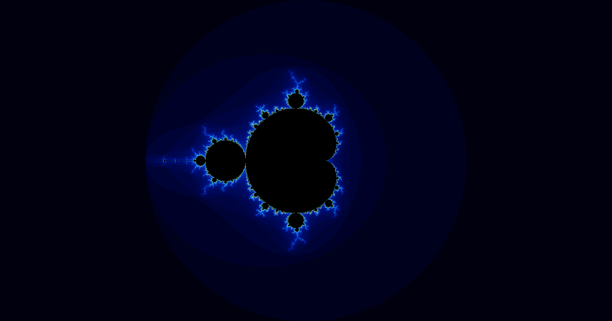
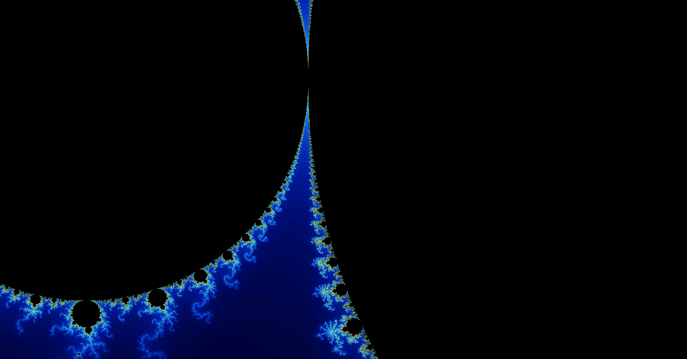
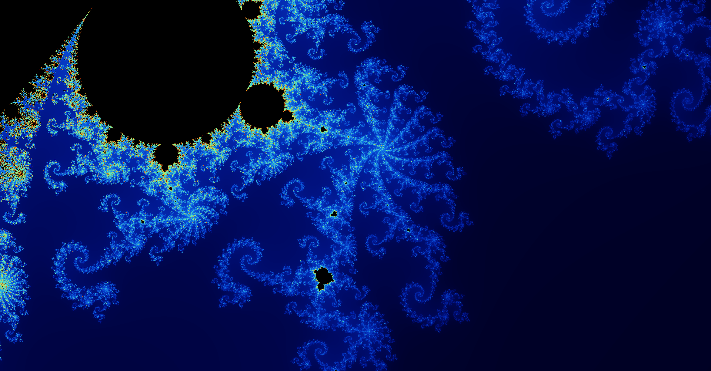
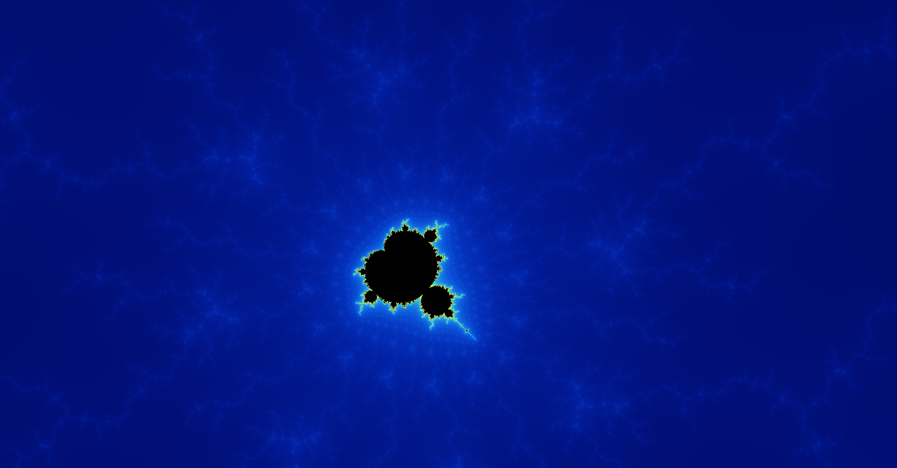

# Mandelbrot-OpenGL

## Description

This is a simple opengl program written in C++ that lets the user visualize and zoom in the mandelbrot set. Since all the computations are done on the gpu, the zooming capabilities are limited to the precision of doubles on the gpu.

## Setup

1. Clone the repository
2. Download the *__glad__* and *__glfw__* libraries. Glfw will also need to be compiled (a more in-depth tutorial can be found on [learnopengl.com](https://learnopengl.com/Getting-started/Creating-a-window).
3. Set up the include, source and library directories in the project properties using the IDE of your choice.

## Controls

1. Moving around: 
    * **WASD** / **Arrow Keys**
    * **Panning with mouse**
2. Zooming in / out:
    * **Scroll wheel up / 'I' key to zoom in**
    * **Scroll wheel down / 'O' key to zoom out**
3. Changing iteration count:
    * **'+' key to increase iteration count**
    * **'-' key to decrease iteration count**
4. Exit the program:
    * **'ESC' key**

## Samples

  
  
  
  
  

